# CampusConnect 🎓🛒

CampusConnect is a campus-based student marketplace platform where students can buy and sell products within their college community.

The platform helps students connect, communicate, and trade products in a trusted campus environment.

---

## Project Overview

CampusConnect is designed to simplify campus buying and selling.

Students can:

* Sell products
* Buy products
* Add products to wishlist
* Chat with sellers in real time
* Receive instant notifications
* Manage their profiles

This creates a safe and organized student marketplace.

---

## Features

### User Features

✅ User Registration
✅ User Login
✅ Profile Management
✅ Seller Profile View
✅ Buyer Profile View
✅ Wishlist Management
✅ Real-time Chat
✅ Notification System

---

### Product Features

✅ Add Product
✅ Edit Product
✅ Delete Product
✅ Browse Products
✅ Search Products
✅ Filter by Category
✅ Product Status Tracking

---

### Admin Features

✅ Admin Dashboard
✅ Product Approval
✅ User Management
✅ Category Management
✅ Pending Product Management
✅ Rejected Product Management
✅ Sold Product Management

---

## Real-time Features

* Real-time messaging using SignalR
* Chat message notifications
* Wishlist sold product notifications

---

## Technology Stack

### Backend

* ASP.NET Core MVC
* Entity Framework Core

### Frontend

* HTML
* CSS
* Bootstrap
* JavaScript

### Database

* SQL Server

### Authentication

* ASP.NET Identity

### Real-time Communication

* SignalR

---

## System Workflow

1. User registers
2. User logs in
3. User completes profile
4. User explores marketplace
5. User lists products for selling
6. Buyer searches products
7. Buyer adds products to wishlist
8. Buyer chats with seller
9. Notifications are triggered
10. Product gets sold

---

## Project Structure

```text id="mjlwmc"
CampusConnect/
├── Controllers/
├── Models/
├── Views/
├── Data/
├── Services/
├── Hubs/
├── Helpers/
├── Migrations/
├── wwwroot/
├── screenshots/
├── Program.cs
├── CampusConnect.csproj
├── README.md
└── .gitignore
```

---

## Project Screenshots

### Home Page

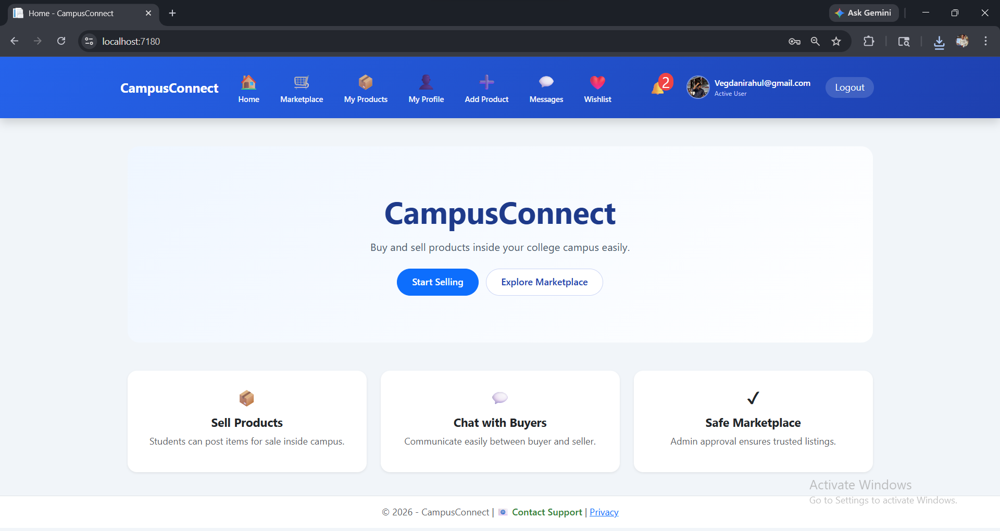

### Login Page

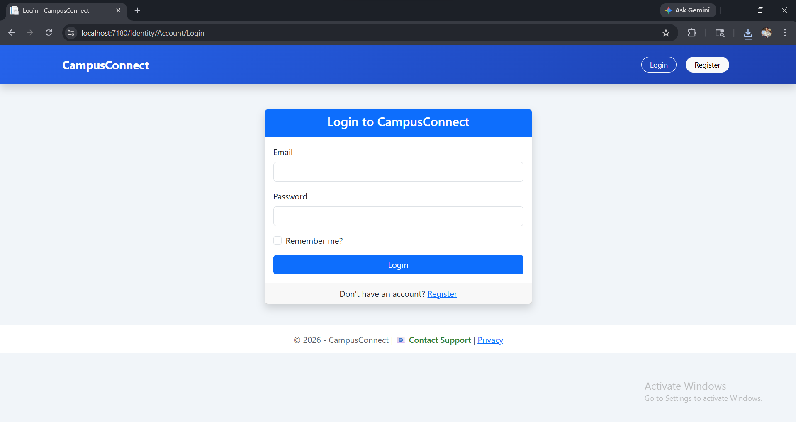

### Register Page

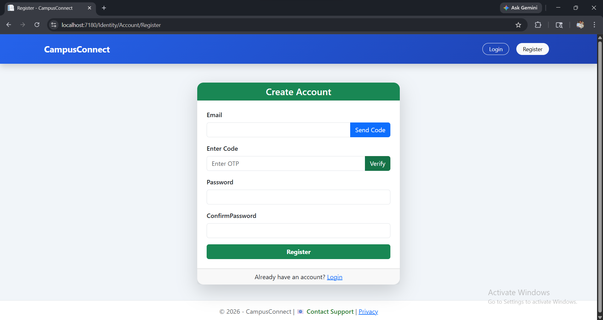

### Market Page

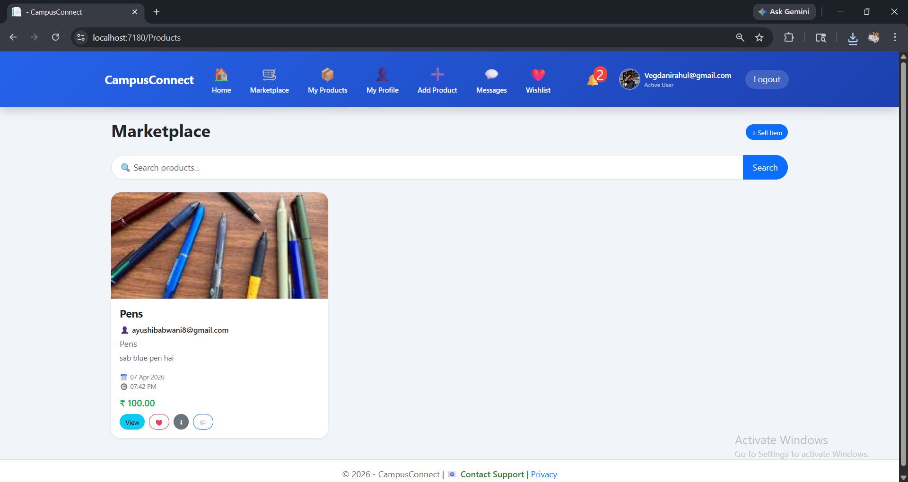

### Add Product Page

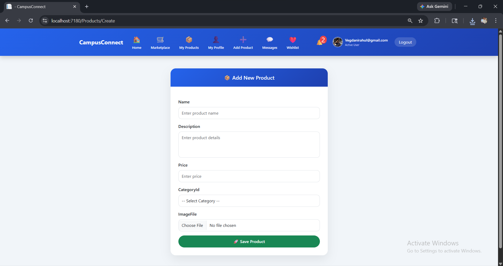

### My Profile Page

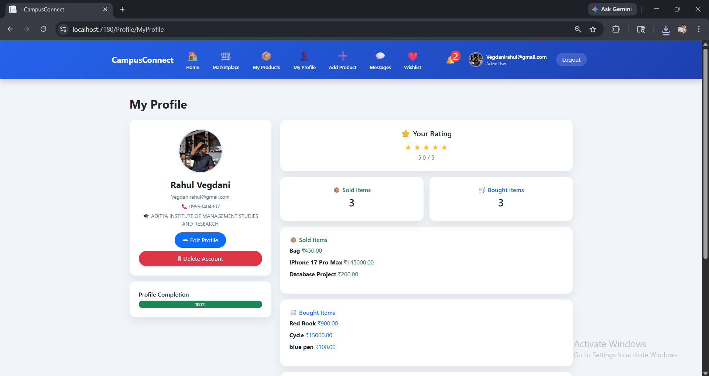

### Profile Review Page

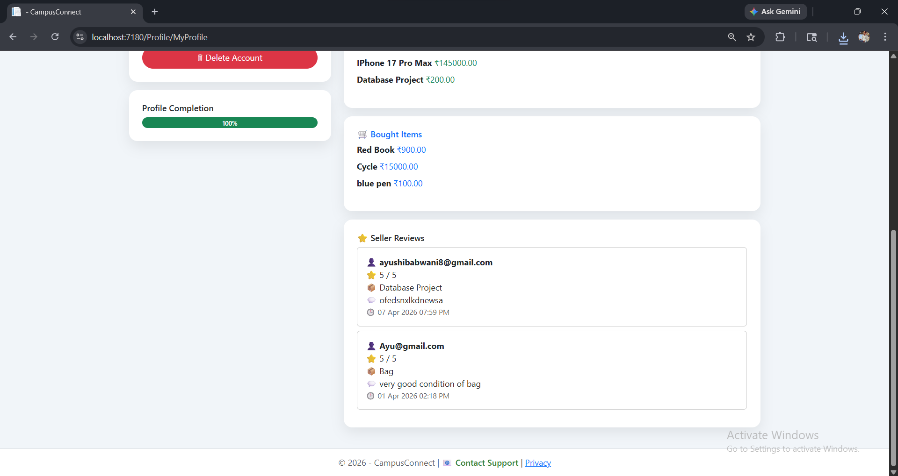

### My Product Page

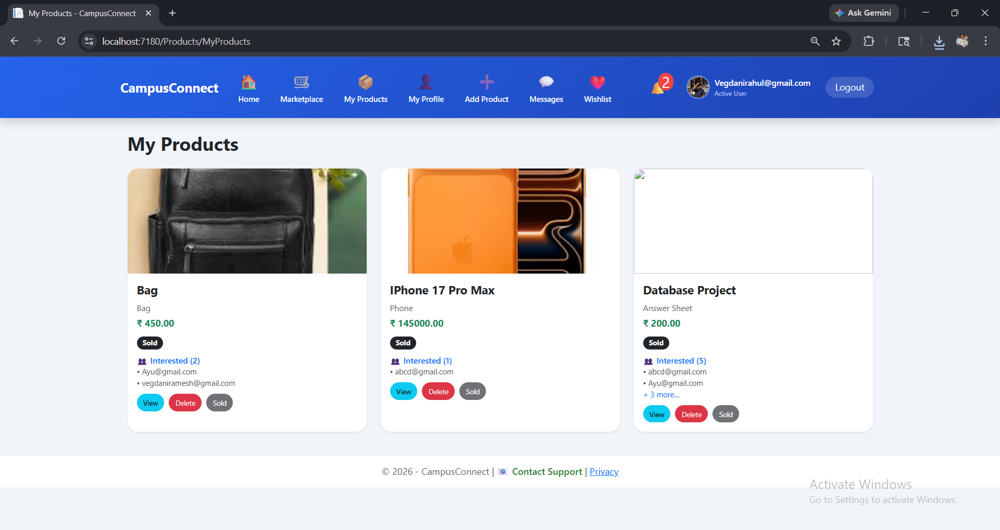

### Chat Page

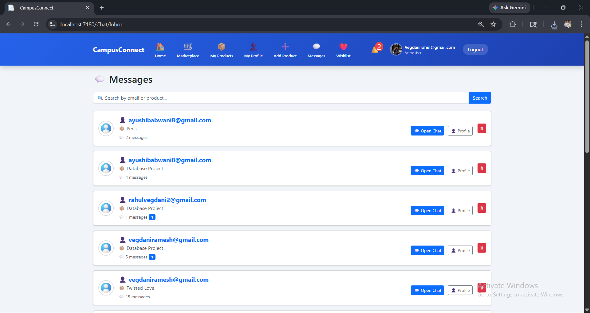

### Wishlist Page

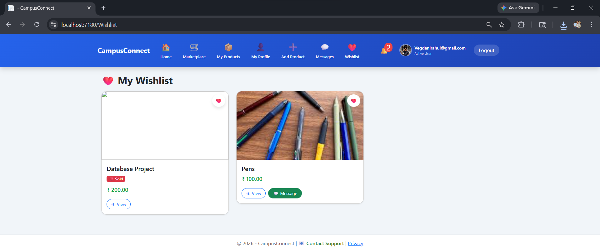

### Notification Page

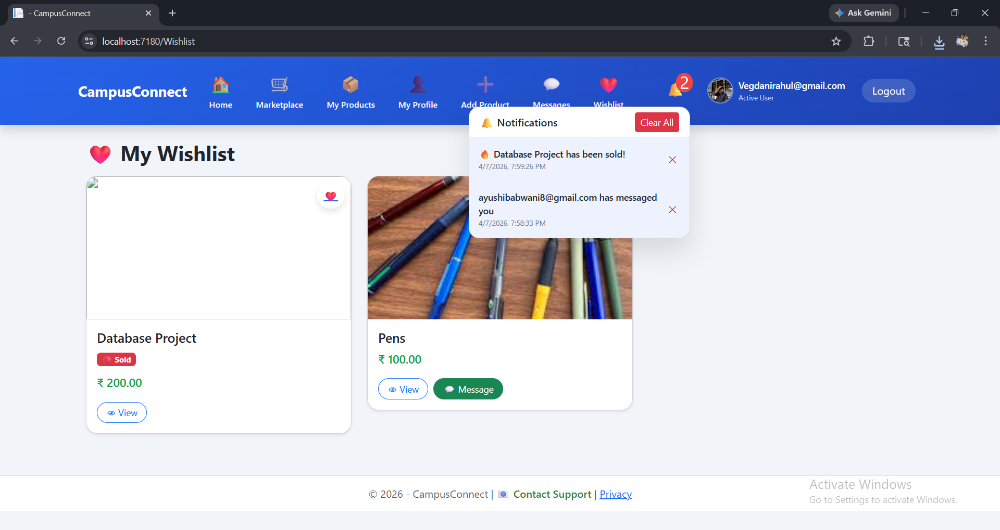

### Admin Dashboard Page

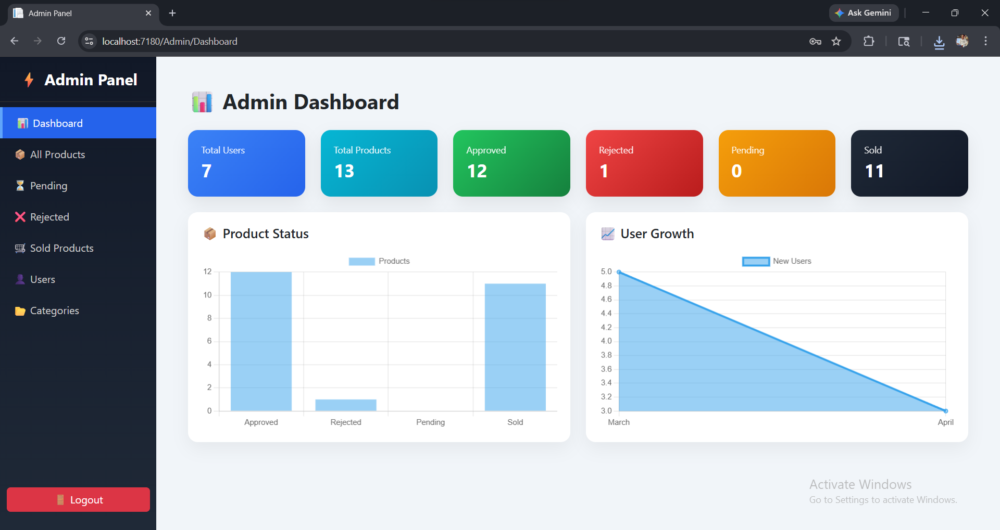

### Admin All Product Page

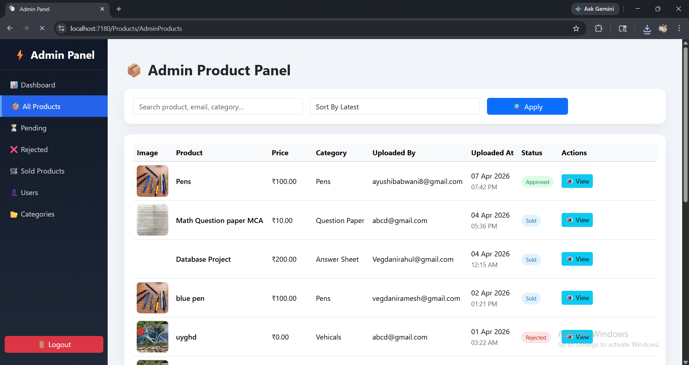

### Admin Pending Product Page

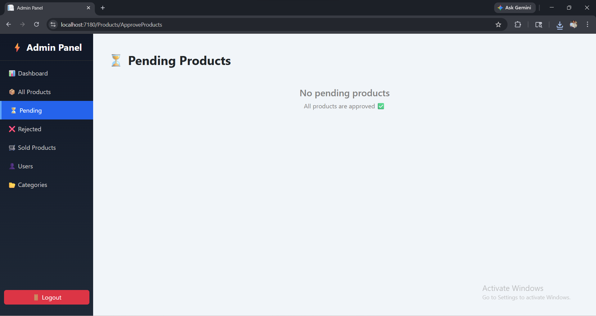

### Admin Rejected Product Page

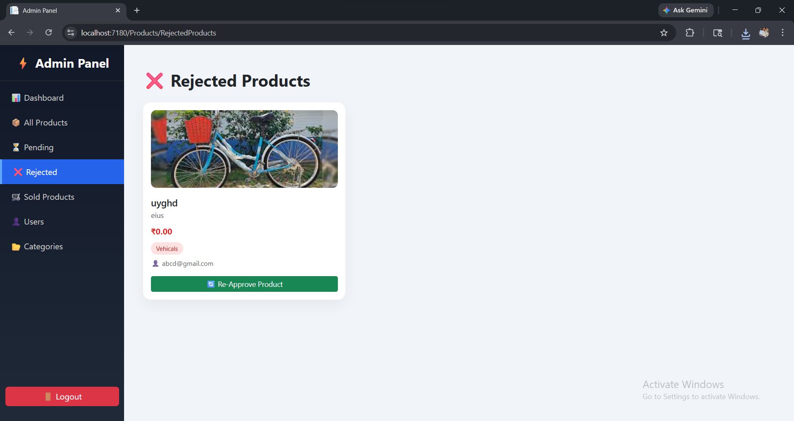

### Admin Sold Product Page

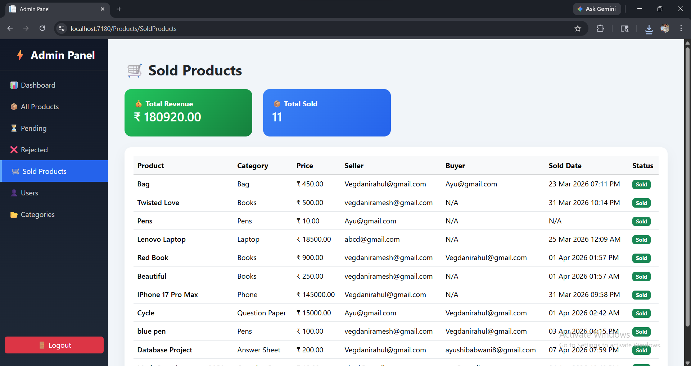

### Admin User Management Page

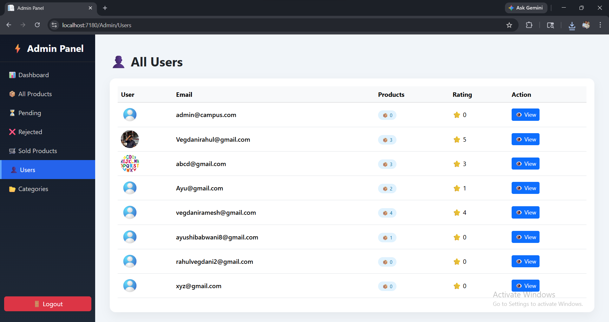

### Admin Category Management Page

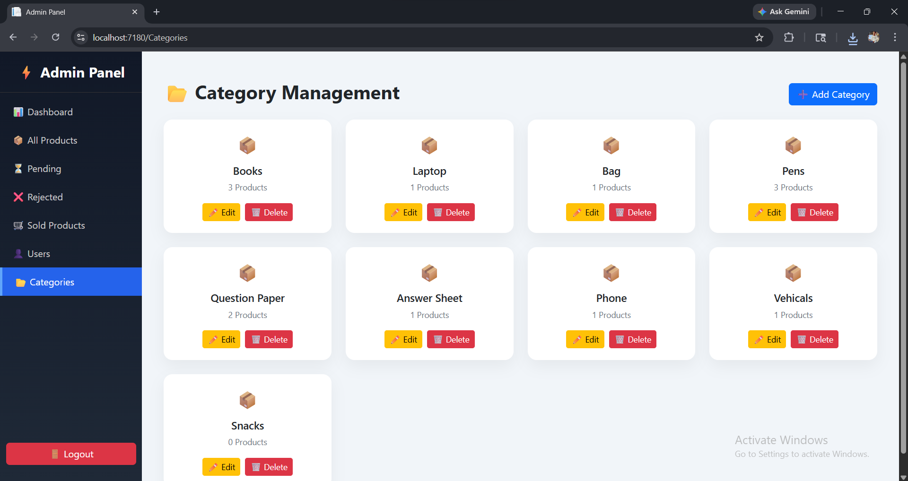

---

## Installation

Clone the repository:

```bash id="dclbks"
git clone https://github.com/rahulvegdani/CampusConnect.git
```

Open the project in Visual Studio.

Configure SQL Server connection string in:

```text id="isdbdn"
appsettings.json
```

Run database migration:

```powershell id="97gks0"
Update-Database
```

Run project:

```text id="s9m70f"
Ctrl + F5
```

---

## Future Enhancements

* AI-based product recommendations
* Mobile application
* Online payment integration
* Review and rating system

---

## Author

Rahul Vegdani

---

## Status

🚀 Active Development
